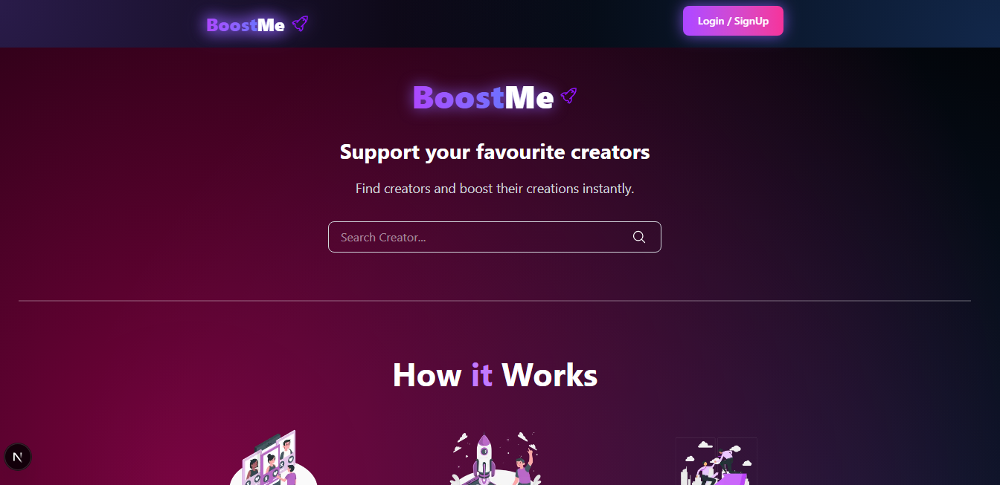
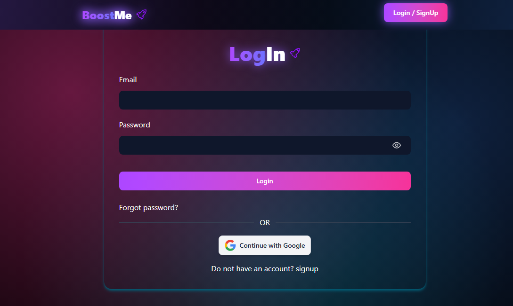
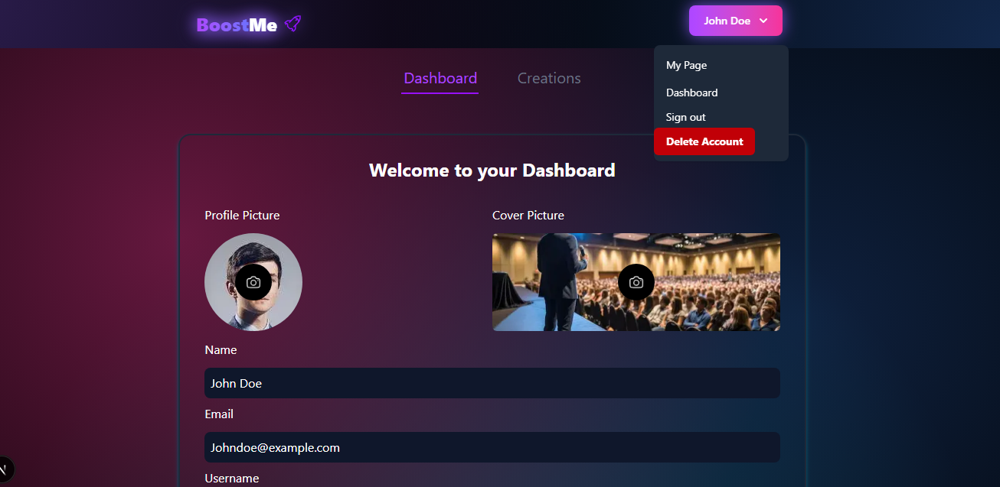
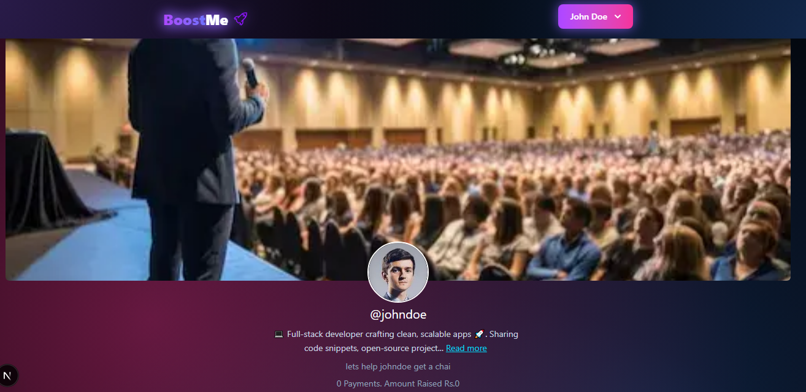
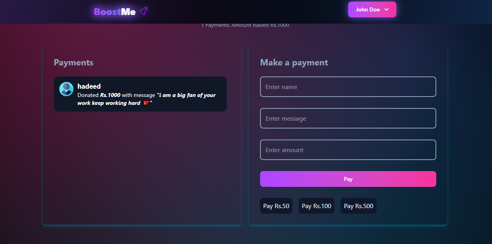
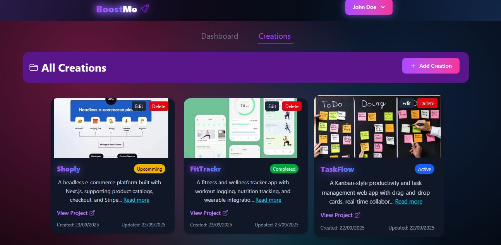
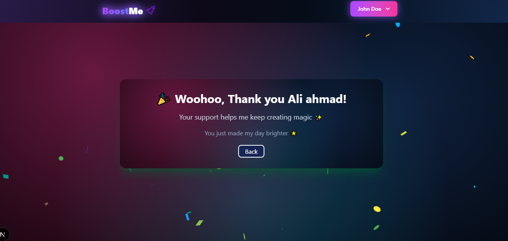

# 🚀 BoostMe

<div align="center">

🎨 A platform where **fans can support their favorite creators**.  
Creators showcase their work, and fans explore, connect, and provide support.

---

🖥️ **Built with:**  


  

  


</div>

---

## ✨ Features

- 👤 **Authentication** – Secure login & signup with [NextAuth v5](https://next-auth.js.org/) (Google OAuth + Email/Password)
- 🎨 **Creator Profiles** – Creators can set up a profile
- 📂 **Creations** – Upload and manage works (cover images stored in Cloudinary)
- 💖 **Fan Support** – Fans can explore creators and provide financial support
- 🔍 **Search & Discovery** – Search creators and view their dedicated pages
- ☁️ **Image Uploads** – Cloudinary integration for avatars & creation covers

---

## 🖼️ Screenshots

### Homepage



### Login



### Dashboard



### User Page



### Payments



### Creations



### Payment Done



## 🛠️ Tech Stack

- **Framework**: [Next.js](https://nextjs.org/) (Full-stack)
- **UI**: [React](https://react.dev/), [TailwindCSS](https://tailwindcss.com/)
- **Authentication**: [NextAuth.js v5](https://next-auth.js.org/)
- **Database**: [MongoDB](https://www.mongodb.com/) with [Mongoose ODM](https://mongoosejs.com/)
- **File Storage**: [Cloudinary](https://cloudinary.com/)

---

## 🚀 Getting Started

1.  Clone the repo

```bash
git clone https://github.com/wareesha-Jannat/boostme.git
cd boostme

```

2.  Install dependencies

```bash
npm install
```

3. Start the development server:

```bash
npm run dev
```


## Live Demo

[Visit the live site](https://boostme-henna.vercel.app)

## Credits

-<a href="https://storyset.com/">Illustrations by Storyset</a>
